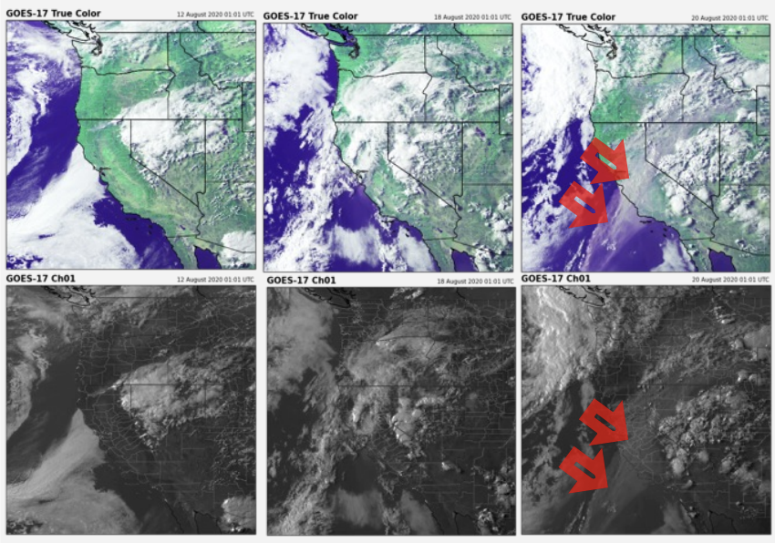
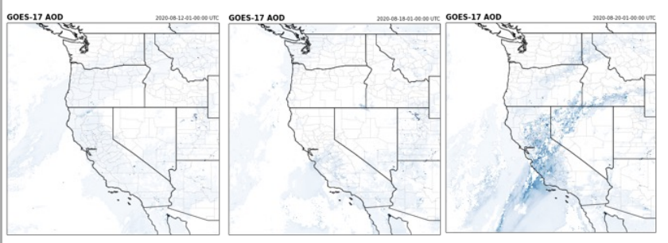
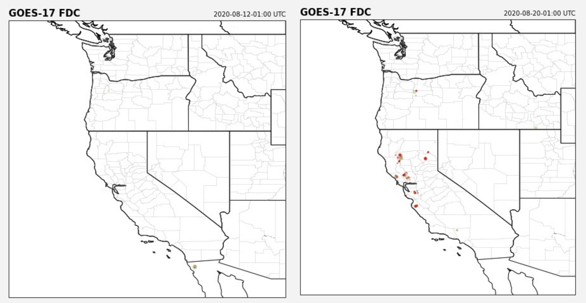
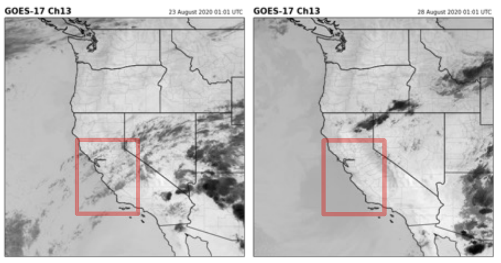
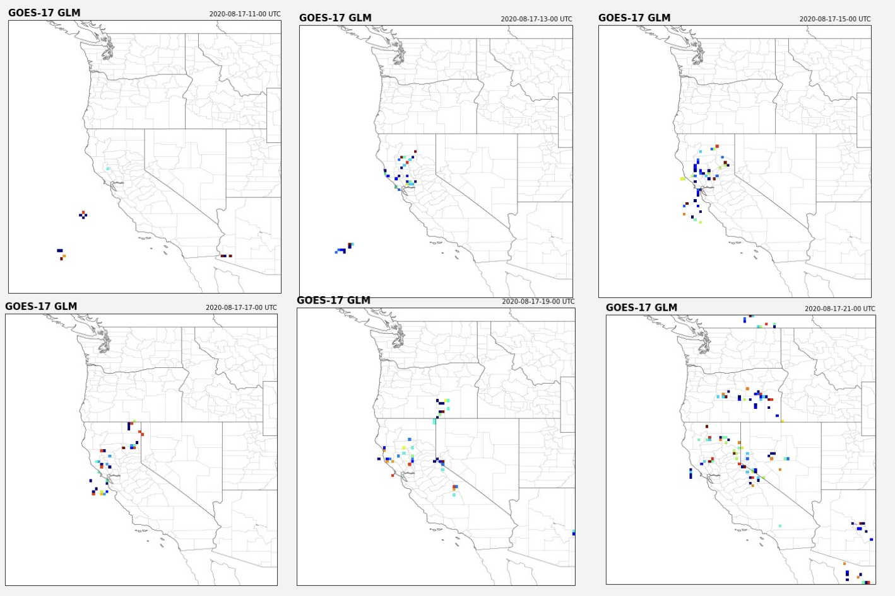

# Overview:
This project explores the use of GOES-17 satellite bands for detecting and analyzing wildfire hazards such as smoke, fire, lightning, and dryness. Specifically, it focuses on the August 2020 California Wildfires [1], which were part of the August Complex Fire—one of the largest wildfires in California’s history. By examining different GOES-17 bands (ABI-1, ABI-2, ABI-3, ABI-13, AOD (Aerosol Optical Depth), FDC (Fire Detection and Characterization), and GLM(Geostationary Lightning Mapper)), we can visualize fire locations, monitor smoke spread, detect lightning events, and evaluate ground-level humidity [3].

This code is used for GOES16/17 Virtual Science Fair - 2022 Middle School 1st Place Project. [Award announcement page](https://cimss.ssec.wisc.edu/education/goesr/1stPlace2022.html)

See Poster [here](MiddleSchool-VSF_EricSun_SeanJiang_Poster.pdf)

See presentation [here](https://youtu.be/y3VNeUSRuiM?si=xi6uQvIPewiQX9-N)

# Code Explained
## 1. **Data Retrieval**:  
   - Uses [NOAA GOES-17 data](https://registry.opendata.aws/noaa-goes/) stored in an AWS S3 bucket (`noaa-goes17`) to retrieve different products (e.g., ABI-L2-AODC) [2].


## 2. **Visualization**:  
   - Leverages **Cartopy** for geographic mapping and shapefile boundary rendering (e.g., counties, coastlines, and states).
   - Displays aerosol optical depth (AOD) information to identify smoke plumes.
   - Can be adapted to visualize Fire Detection Characterization (FDC), True Color (ABI-1, -2, -3), or other GOES-17 bands.


- Top row: True Color RGB composition (Red,
ABI-1; Green, ABI-3; Blue, ABI-2)
- Bottom row: ABI-1 band alone (visible “Blue Band”)


Aerosol Optical Depth (AOD)


Fire Detection and Characterization (FDC)


ABI-13 Band detects humidity


Geostationary Lightning Mapper (GLM)


## 3. **Analysis**:  
   - Illustrates a time-series approach: loops over specific days and hours to capture the evolution of smoke and fire conditions.
   - Applies simple formulas for combining spectral bands (e.g., True Color composites).

# Requirements

- **Python 3.7+** (recommended)  
- **Libraries**:
  - [xarray](https://docs.xarray.dev/en/stable/)
  - [netCDF4](https://unidata.github.io/netcdf4-python/)
  - [cartopy](https://scitools.org.uk/cartopy/docs/latest/)
  - [matplotlib](https://matplotlib.org/)
  - [numpy](https://numpy.org/)
  - [requests](https://pypi.org/project/requests/)
  - [boto3](https://boto3.amazonaws.com/v1/documentation/api/latest/index.html)
  - [botocore](https://pypi.org/project/botocore/)
  - [metpy](https://unidata.github.io/MetPy/latest/)

To install them quickly via pip:
```bash
pip install xarray netCDF4 cartopy matplotlib numpy requests boto3 botocore metpy
``` 
 
# Code Usage
## 1. **Open the Jupyter Notebook**:  
   Launch Jupyter Notebook in your terminal:
   ```bash
   jupyter notebook
   ```
   Then open the `.ipynb` file that contains the code snippet.

## 2. **Configure Parameters**:  
   Inside the code, you will find variables such as:
   ```python
   bucket_name = 'noaa-goes17'
   product_name = 'ABI-L2-AODC'
   year = 2020
   day_of_year = 235
   hour = 1
   band = 8
   ```
   Modify these parameters to fetch different GOES-17 products, dates, and times.

## 3. **Shapefiles**:  
   Ensure you have the necessary shapefiles (e.g., `countyl010g.shp`) downloaded locally to visualize county boundaries. Update the path to the shapefile as needed.

## 4. **Output**:  
   The notebook will display map plots with:
   - Smoke plumes (AOD) or other features (FDC, True Color, etc.).
   - State and county boundaries.
   - Titles indicating the timestamp of the data capture.

# Troubleshooting
- If you encounter an error involving **Cartopy** or **Proj** not found, install or update your system’s PROJ and GEOS libraries and then reinstall Cartopy.
- Make sure your shapefile path (`countyl010g_shp/countyl010g.shp`) is correct.  
- For large data downloads from S3, ensure you have a stable internet connection and sufficient memory.

# References

1. “August Complex Fire”:
    [Wikipedia](https://en.m.wikipedia.org/wiki/August_2020_California_lightning_wildfires)
2. NOAA GOES-17 (Hosted on AWS):  
   [https://registry.opendata.aws/noaa-goes/](https://registry.opendata.aws/noaa-goes/)
3. This code is modified from an Unidata Training example written by Brian Blaylock:
    [https://unidata.github.io/python-training/gallery/mapping_goes16_truecolor/](https://unidata.github.io/python-training/gallery/mapping_goes16_truecolor/)

# License

This project is distributed under the [MIT License](https://opensource.org/licenses/MIT). Please see the [LICENSE](LICENSE) file for more details (if included in the repository).